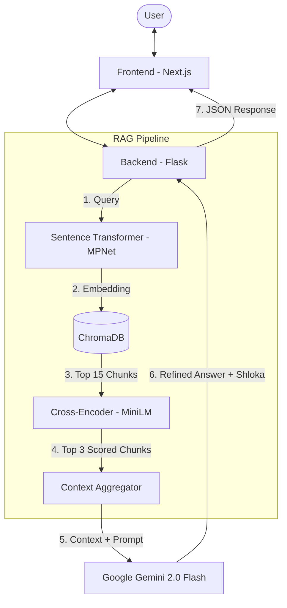

# 🌿 AyurBot: Your Ayurvedic AI Guide

AyurBot is a state-of-the-art AI assistant powered by the **Charaka Samhita**, one of the foundational texts of Ayurveda. It provides authentic, scriptural-based Ayurvedic knowledge through a modern, interactive chat interface.

## 🚀 Overview

AyurBot uses a **Retrieval-Augmented Generation (RAG)** pipeline to ensure that its answers are not just AI-generated but are grounded in the actual verses (Shlokas) of the Charaka Samhita.

### Key Features
- **Authentic Knowledge**: Grounded in the Charaka Samhita.
- **RAG Powered**: Retrieves relevant passages before generating answers.
- **Bilingual Context**: Combines Sanskrit Shlokas with their English explanations.
- **Smart Reranking**: Uses Cross-Encoders to ensure the most relevant context is prioritized.
- **Premium UI**: Modern, responsive interface built with Next.js and Tailwind CSS.

---

## 🏗️ System Architecture



---

## 🛠️ Tech Stack

| Component | Technology | Description |
| :--- | :--- | :--- |
| **Frontend** | [Next.js](https://nextjs.org/) | React framework for build and UI. |
| **Styling** | [Tailwind CSS](https://tailwindcss.com/) | Utility-first CSS for modern design. |
| **Backend** | [Flask](https://flask.palletsprojects.com/) | Python web framework for the API. |
| **Vector DB** | [ChromaDB](https://www.trychroma.com/) | Open-source vector database. |
| **Embeddings** | [MPNet-v2](https://huggingface.co/sentence-transformers/paraphrase-multilingual-mpnet-base-v2) | Multilingual sentence embeddings. |
| **Reranker** | [Cross-Encoder](https://huggingface.co/cross-encoder/ms-marco-MiniLM-L-6-v2) | High-precision passage reranking. |
| **LLM** | [Google Gemini 2.0 Flash](https://ai.google.dev/) | Advanced generative AI for synthesis. |

---

## 📁 Repository Structure

- `chat.py`: The main Flask API server handling logic and RAG.
- `vector.py`: Script to initialize and populate the vector database.
- `scrape.py`: Web scraper for extracting chapters from Charaka Samhita Online.
- `prep_rescue.py`: Data cleaning and preprocessing for text pairing.
- `frontend/`: Next.js application directory.
- `charaka_data/`: Raw and preprocessed data storage.

---

## ⚙️ Getting Started

### Prerequisites
- Python 3.9+
- Node.js 18+
- Google Gemini API Key

### Backend Setup
1. Clone the repository and navigate to the root:
   ```bash
   git clone https://github.com/letusnotc/AyurBot.git
   cd AyurBot
   ```
2. Install Python dependencies:
   ```bash
   pip install flask flask-cors chromadb sentence-transformers google-generativeai python-dotenv requests beautifulsoup4 tqdm
   ```
3. Create a `.env` file in the root:
   ```env
   GEMINI_API_KEY=your_api_key_here
   ```
4. (Optional) Populate the Vector DB:
   ```bash
   python vector.py
   ```
5. Start the Flask server:
   ```bash
   python chat.py
   ```

### Frontend Setup
1. Navigate to the frontend directory:
   ```bash
   cd frontend
   ```
2. Install dependencies:
   ```bash
   npm install
   ```
3. Start the development server:
   ```bash
   npm run dev
   ```

---

## 🧠 Detailed RAG Pipeline

AyurBot doesn't just "guess" the answer. It follows a rigorous retrieval process:

1. **Semantic Search**: We embed your question into a high-dimensional vector space.
2. **Vector Retrieval**: ChromaDB finds the 15 most similar text chunks based on the English explanations.
3. **Cross-Encoder Reranking**: A specialized model re-evaluates those 15 chunks against your query, picking the **Top 3** that truly answer the question.
4. **Context Synthesis**: Gemini 2.0 Flash reads these top chunks and synthesizes a professional Ayurvedic response.
5. **Shloka Validation**: Finally, the system mandates the inclusion of a relevant Devanagari Shloka and its translation to provide scriptural proof.

---

*AyurBot is dedicated to preserving and providing easy access to the ancient wisdom of Ayurveda.*
