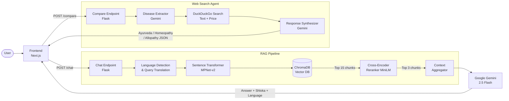

# 🌿 AyurBot: Your Ayurvedic AI Guide

AyurBot is a state-of-the-art AI assistant powered by the **Charaka Samhita**, one of the foundational texts of Ayurveda. It provides authentic, scriptural-based Ayurvedic knowledge through a modern, interactive chat interface — now with multilingual support and a live treatment comparison engine.

## 🎬 Demo

[](https://drive.google.com/file/d/1aCxYTubrsitu7pnc42kZs656wr82qtKN/view?usp=sharing)

> Click the thumbnail to watch the full demo video.

## 🚀 Overview

AyurBot uses a **Retrieval-Augmented Generation (RAG)** pipeline to ensure that its answers are not just AI-generated but are grounded in the actual verses (Shlokas) of the Charaka Samhita.

### Key Features
- **Authentic Knowledge**: Grounded in the Charaka Samhita.
- **RAG Powered**: Retrieves relevant passages before generating answers.
- **Bilingual Context**: Combines Sanskrit Shlokas with their English explanations.
- **Smart Reranking**: Uses Cross-Encoders to ensure the most relevant context is prioritized.
- **Multilingual Responses**: Answer in Hindi, Chhattisgarhi, Marathi, Bengali, Tamil, or English.
- **Treatment Comparison**: Side-by-side Ayurveda vs Homeopathy vs Allopathy comparison via live web search.
- **Premium UI**: Modern, responsive interface built with Next.js and Tailwind CSS.

---

## 🏗️ System Architecture



---

## 🌐 Multilingual Support

AyurBot can understand queries and respond in **6 Indian languages**:

| Language | Script |
| :--- | :--- |
| English | Latin |
| Hindi | हिंदी |
| Chhattisgarhi | छत्तीसगढ़ी |
| Marathi | मराठी |
| Bengali | বাংলা |
| Tamil | தமிழ் |

**How it works:**
1. The user selects a language from the dropdown in the chat header.
2. If a non-English language is selected, the query is **translated to English** by Gemini before RAG retrieval (the vector database is English-only).
3. The same Gemini call that synthesizes the answer is instructed to **respond entirely in the selected language**, including headings and bullet points. Only the Devanagari Sanskrit Shloka remains unchanged.

---

## ⚖️ Treatment Comparison Engine

The **Treatment Comparison** page allows users to compare how three major medical systems approach any disease or condition.

**How it works:**
1. The user describes their condition in natural language (e.g. *"I have joint pain"*).
2. Gemini extracts the precise disease/condition name from the query.
3. Three parallel **DuckDuckGo web searches** are performed:
   - Ayurveda treatment for `{disease}`
   - Homeopathy treatment for `{disease}`
   - Allopathy treatment for `{disease}`
4. A separate price search is run for each system.
5. Gemini synthesizes each set of search results into a structured response containing:
   - A 2–3 sentence treatment description
   - Key medicines / remedies
   - One-line treatment philosophy
   - Approximate cost in INR
6. Results are displayed in a **3-column comparison card** with colour-coded headers.

---

## 🛠️ Tech Stack

| Component | Technology | Description |
| :--- | :--- | :--- |
| **Frontend** | [Next.js](https://nextjs.org/) | React framework for build and UI. |
| **Styling** | [Tailwind CSS](https://tailwindcss.com/) | Utility-first CSS for modern design. |
| **Animations** | [GSAP + SplitText](https://gsap.com/) | Letter-by-letter heading animations. |
| **Backend** | [Flask](https://flask.palletsprojects.com/) | Python web framework for the API. |
| **Vector DB** | [ChromaDB](https://www.trychroma.com/) | Open-source vector database. |
| **Embeddings** | [MPNet-v2](https://huggingface.co/sentence-transformers/paraphrase-multilingual-mpnet-base-v2) | Multilingual sentence embeddings. |
| **Reranker** | [Cross-Encoder](https://huggingface.co/cross-encoder/ms-marco-MiniLM-L-6-v2) | High-precision passage reranking. |
| **LLM** | [Google Gemini 2.5 Flash](https://ai.google.dev/) | Answer synthesis, translation, comparison. |
| **Web Search** | [DDGS](https://pypi.org/project/ddgs/) | DuckDuckGo search for live treatment data. |

---

## 📁 Repository Structure

- `chat.py` — Main Flask API: `/chat` (RAG) and `/compare` (web search agent) endpoints.
- `vector.py` — Script to initialize and populate the ChromaDB vector database.
- `scrape.py` — Web scraper for extracting chapters from Charaka Samhita Online.
- `prep_rescue.py` — Data cleaning and preprocessing for Sanskrit–English text pairing.
- `frontend/` — Next.js application directory.
  - `app/page.tsx` — Chat interface with language selector.
  - `app/compare/page.tsx` — Treatment comparison page.
  - `app/Sidebar.tsx` — Vertical navigation sidebar.
  - `app/components/SplitText.jsx` — GSAP letter animation component.
- `charaka_data/` — Raw and preprocessed data storage.

---

## ⚙️ Getting Started

### Prerequisites
- Python 3.9+
- Node.js 18+
- Google Gemini API Key

### Backend Setup
1. Clone the repository and navigate to the root:
   ```bash
   git clone https://github.com/letusnotc/AyurBot.git
   cd AyurBot
   ```
2. Install Python dependencies:
   ```bash
   pip install flask flask-cors chromadb sentence-transformers google-generativeai python-dotenv requests beautifulsoup4 tqdm ddgs
   ```
3. Create a `.env` file in the root:
   ```env
   GEMINI_API_KEY=your_api_key_here
   ```
4. (Optional) Populate the Vector DB:
   ```bash
   python vector.py
   ```
5. Start the Flask server:
   ```bash
   python chat.py
   ```

### Frontend Setup
1. Navigate to the frontend directory:
   ```bash
   cd frontend
   ```
2. Install dependencies:
   ```bash
   npm install
   ```
3. Start the development server:
   ```bash
   npm run dev
   ```

---

## 🧠 Detailed RAG Pipeline

AyurBot doesn't just "guess" the answer. It follows a rigorous retrieval process:

1. **Language Detection**: If a non-English language is selected, the query is translated to English for retrieval.
2. **Semantic Search**: The (translated) query is embedded into a high-dimensional vector space.
3. **Vector Retrieval**: ChromaDB finds the 15 most similar text chunks.
4. **Cross-Encoder Reranking**: A specialized model re-evaluates those 15 chunks, picking the **Top 3** most relevant.
5. **Context Synthesis**: Gemini 2.5 Flash reads the top chunks and synthesizes a structured Ayurvedic response in the user's chosen language.
6. **Shloka Validation**: The system mandates a relevant Devanagari Shloka and its translation for scriptural proof.

---

*AyurBot is dedicated to preserving and providing easy access to the ancient wisdom of Ayurveda.*
